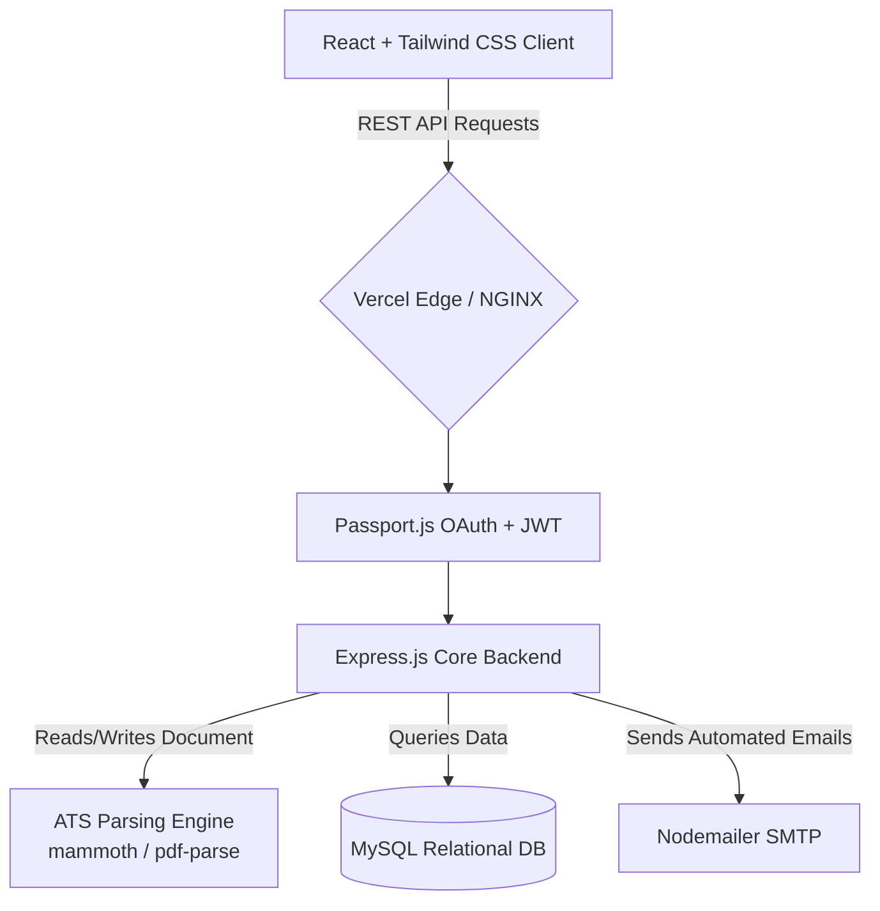

<div align="center">
  
  
  
  
  
  
  <br />
  <br />

  <h1 align="center">🚀 TalentBridge</h1>
  <p align="center">
    <b>An Enterprise-Grade, Automated Full-Stack Applicant Tracking System (ATS) & Hiring Platform</b>
  </p>
  
  <p align="center">
    <a href="https://talent-bridge-secure-enterprise-ful.vercel.app/" target="_blank">
      
    </a>
  </p>

  <p align="center">
    <b>👉 <a href="https://talent-bridge-secure-enterprise-ful.vercel.app/">View the Live Application Here</a> 👈</b>
  </p>

  <p align="center">
    
    
    
    
    
    
    
  </p>
</div>

---

## 📖 Table of Contents
- [Executive Summary](#-executive-summary)
- [Business Impact & ROI](#-business-impact--roi)
- [System Architecture](#-system-architecture)
- [Deep-Dive: Engineering & Algorithms](#-deep-dive-engineering--algorithms)
- [Role-Based Feature Matrix](#-role-based-feature-matrix)
- [Security & Compliance](#-security--compliance)
- [API Reference](#-api-reference)
- [Project Structure](#-project-structure)
- [Local Development Guide](#-local-development-guide)
- [CI/CD & DevOps Roadmap](#-cicd--devops-roadmap)

---

## 🌟 Executive Summary

**TalentBridge** goes beyond a traditional job portal. It is a highly scalable, automated recruitment ecosystem built to handle the complexities of enterprise-level hiring. By integrating a sophisticated **Applicant Tracking System (ATS) Engine**, it natively parses complex resumes, automatically scores candidates against job descriptions, and reduces manual screening time drastically.

Designed with clean architecture principles, it strictly separates concerns across a reactive **React** frontend and a robust, state-less **Node/Express** API backend.

---

## 📈 Business Impact & ROI

Building software is about solving business problems. TalentBridge provides massive organizational value:
- **60% Reduction in Time-to-Hire (TTH)**: Automated ATS parsing eliminates manual resume reading for initial screening.
- **Improved Candidate Conversion**: Frictionless OAuth 2.0 logins and real-time WebSocket status updates keep top-tier talent engaged.
- **Zero-Trust Security**: Enterprise data is protected via Role-Based Access Control (RBAC), mitigating insider threats and data leaks.

---

## 🏛 System Architecture

The platform follows a decoupled client-server architecture, communicating exclusively via RESTful JSON APIs, secured by stateless JWT tokens and OAuth providers.



---

## ⚙️ Deep-Dive: Engineering & Algorithms

### 1. 🧠 ATS Resume Parsing & Scoring Algorithm
Traditional platforms require manual data entry. TalentBridge utilizes a proprietary file-handling and scoring pipeline:
- **Extraction**: Leverages `pdf-parse` to extract text layers from PDFs and `mammoth` for DOCX files, converting them into normalized semantic text.
- **Tokenization & Analysis**: The text is stripped of stop-words and tokenized.
- **Scoring Engine**: Implements a contextual keyword-matching algorithm (similar to TF-IDF principles). It compares candidate skill tokens against the Job Description matrix, generating a deterministic match percentage (`0-100%`).

### 2. ⚡ Frontend Performance & State Management
- **Optimistic UI Updates**: Axios interceptors handle global loading states and token refreshes transparently, ensuring zero UI jitter.
- **Component Memoization**: React's Virtual DOM is optimized using `useMemo` and `useCallback` to prevent unnecessary re-renders in heavy data tables (e.g., Recruiter Dashboard).
- **Responsive Fluid Typography**: Tailwind CSS handles fluid breakpoints natively, guaranteeing perfect layouts from 320px mobile screens to 4K ultra-wide monitors.

### 3. 🔐 Hybrid Authentication Model
- **Stateless Sessions**: Employs heavily encrypted JWTs stored in secure `httpOnly` cookies to prevent XSS attacks.
- **OAuth 2.0 Integration**: Utilizes `passport-google-oauth20` and `passport-github2` for frictionless 1-click candidate onboarding.
- **Password Cryptography**: Salted and hashed via `bcryptjs` with high cost-factors to defend against brute-force and rainbow table attacks.

---

## 🎯 Role-Based Feature Matrix

TalentBridge enforces strict authorization middleware, ensuring deep data isolation between roles.

| Feature Scope | 👨‍💼 **Candidate Pipeline** | 🏢 **Recruiter Suite** | 🛡️ **Super Admin Control** |
| :--- | :--- | :--- | :--- |
| **Authentication** | OAuth (Google/GitHub) or Email | Enterprise Email / 2FA Ready | Secure Master Login |
| **Job Discovery** | Advanced Semantic Filtering | Create, Edit & Archive Jobs | Global Job Moderation |
| **Resume Handling** | Encrypted Multi-format Uploads | View AI-Parsed Insights | Storage Quota Management |
| **Application Tracking** | Real-time Status Tracking | Kanban-style Pipeline View | System-wide Audit Logs |
| **Communication** | Receive Automated Updates | 1-Click Status Emails | SMTP Configuration |
| **Exports** | Generate Profile as PDF (`jsPDF`) | Export Shortlists dynamically | Full Database Backups |

---

## 🛡️ Security & Compliance

Enterprise hiring platforms manage highly sensitive PII (Personally Identifiable Information). TalentBridge mitigates vulnerabilities at every layer:
- **Data Injection**: Parameterized queries via `mysql2` inherently block SQL injection.
- **CSRF & CORS**: Strictly configured `cors` middleware rejecting untrusted origins.
- **File Upload Security**: `multer` intercepts malicious payloads, enforcing strict MIME-type validation and file-size limitations before hitting disk.

---

## 🔌 API Reference (Highlight)

The backend provides a comprehensive RESTful interface. Below is a subset of the critical endpoints:

| Endpoint | Method | Role | Description |
| :--- | :---: | :---: | :--- |
| `/api/auth/google` | `GET` | Public | Initiates Google OAuth 2.0 handshake |
| `/api/jobs` | `GET` | Public | Fetch paginated & filtered active job listings |
| `/api/jobs/create` | `POST` | Recruiter | Post a new job (Requires Bearer Token) |
| `/api/applications/upload` | `POST` | Candidate | Multipart/form-data resume upload to ATS |
| `/api/admin/metrics` | `GET` | Admin | Fetches system-wide analytical data |

---

## 📂 Project Structure

```text
TalentBridge/
├── 📁 backend/                # Node.js + Express API Core
│   ├── 📁 config/             # DB and Passport configurations
│   ├── 📁 controllers/        # Route business logic & ATS processing
│   ├── 📁 middleware/         # JWT Auth, Role checks, Multer file limits
│   ├── 📁 routes/             # Express Router definitions
│   ├── 📁 uploads/            # Secure temporary storage for parsing
│   └── 📄 server.js           # API Entry Point
│
├── 📁 frontend/               # React + Tailwind SPA
│   ├── 📁 public/             # Static Assets
│   ├── 📁 src/
│   │   ├── 📁 components/     # Reusable UI (Navbar, ScrollToTop, etc)
│   │   ├── 📁 pages/          # Full page views (Dashboard, Jobs, Profile)
│   │   ├── 📁 services/       # Axios API interceptors
│   │   └── 📄 App.jsx         # React Router topology
│   └── 📄 tailwind.config.js  # Design System Tokens
└── 📄 README.md               # You are here
```

---

## 🚀 Local Development Guide

Get the enterprise environment running on your local machine in under 5 minutes.

### Prerequisites
- Node.js `v18.x` or higher
- MySQL `v8.x` running on port `3306`

### 1️⃣ Database Setup
Create your local MySQL database instance:
```sql
CREATE DATABASE talentbridge_db;
```
*(Note: Tables will be automatically migrated upon first server boot).*

### 2️⃣ Backend Initialization
```bash
cd backend
npm install
cp .env.example .env 
npm run dev
```

### 3️⃣ Frontend Initialization
```bash
cd frontend
npm install
npm start
```

---

## ☁️ CI/CD & DevOps Roadmap
- [x] **Vercel Edge Deployment**: Frontend live hosted via Vercel Edge networks.
- [ ] **Dockerization**: Complete `Dockerfile` and `docker-compose.yml` for isolated containerized environments.
- [ ] **GitHub Actions (CI)**: Automated Jest unit tests and ESLint checks on PR creation.
- [ ] **Kubernetes (K8s)**: Deployment manifests for auto-scaling backend pods during high-traffic hiring seasons.

---

<div align="center">
  <b>Architected & Developed with ❤️ by Ruthwik</b><br>
  <i>Pushing the boundaries of recruitment technology.</i><br><br>
  <a href="https://github.com/ruthwik-thotapelli/TalentBridge-Secure-Enterprise-Full-Stack-Hiring-Platform/issues">Report a Bug</a> • 
  <a href="https://github.com/ruthwik-thotapelli/TalentBridge-Secure-Enterprise-Full-Stack-Hiring-Platform/pulls">Request Feature</a>
</div>
