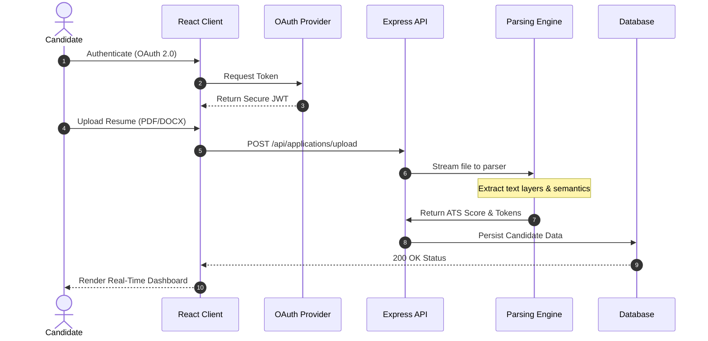
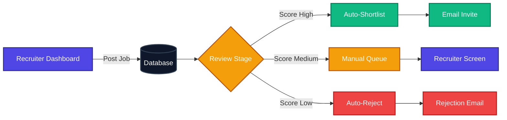
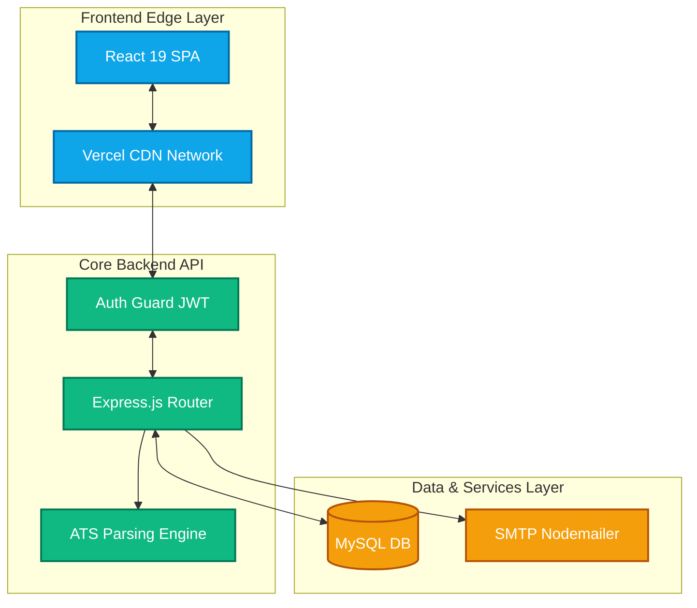

<!-- Dynamic Header -->
<div align="center">
  
</div>

<div align="center">
  <a href="https://talent-bridge-secure-enterprise-ful.vercel.app/" target="_blank">
    
  </a>
  &nbsp;
  
  &nbsp;
  
  &nbsp;
  
</div>

<br />

<div align="center">
  <a href="https://talent-bridge-secure-enterprise-ful.vercel.app/">
    
  </a>
</div>

---

## 🌟 Vision & Business ROI

**TalentBridge** is a modern, high-performance recruitment ecosystem engineered to solve the most expensive problem in HR: **Time-to-Hire (TTH)**. By integrating a proprietary **Applicant Tracking System (ATS)** engine, it automatically parses complex PDFs, tokenizes candidate data, and scores them against job descriptions — eliminating manual screening entirely.

<div align="center">
  
  &nbsp;
  
  &nbsp;
  
</div>

---

## 🎬 Live Demo & Walkthrough

> 🔗 **Experience TalentBridge live:** [**https://talent-bridge-secure-enterprise-ful.vercel.app/**](https://talent-bridge-secure-enterprise-ful.vercel.app/)

### What You Can Do in the Live Demo:
- 🔑 **Sign Up / Login** with Google or GitHub OAuth in 1 click
- 📄 **Upload a Resume** (PDF/DOCX) and watch the ATS engine score it in real-time
- 🔍 **Browse & Filter Jobs** with semantic search capabilities
- 📊 **Recruiter Dashboard** — view ranked candidates, manage pipelines, send emails
- 🛡️ **Admin Panel** — full RBAC control, user management, audit logs

---

## 🔄 Core Workflows & System Architecture

### 1. The Candidate Journey (End-to-End)



### 2. The Recruiter Ecosystem Flow



### 3. Global System Architecture



---

## 💻 Tech Stack Showcase

<table align="center" width="100%">
  <tr>
    <td align="center" width="33%">
      <h3>🎨 Frontend</h3>
      <br><br>
      <b>React 19 &bull; Tailwind CSS &bull; Axios</b><br>
      <sub>Optimistic UI &bull; Memoization &bull; Fluid Layouts</sub>
    </td>
    <td align="center" width="33%">
      <h3>⚙️ Backend</h3>
      <br><br>
      <b>Node.js &bull; Express 5 &bull; MySQL2</b><br>
      <sub>REST API &bull; JWT &bull; Multer &bull; MVC Pattern</sub>
    </td>
    <td align="center" width="33%">
      <h3>🔗 Integrations</h3>
      <br><br>
      <b>Passport.js &bull; Nodemailer &bull; ATS</b><br>
      <sub>OAuth 2.0 &bull; SMTP &bull; Tokenization</sub>
    </td>
  </tr>
</table>

---

## 🎯 Role-Based Data Isolation

TalentBridge enforces strict authorization middleware, guaranteeing deep data privacy.

| 👨‍💼 **Candidate Pipeline** | 🏢 **Recruiter Suite** | 🛡️ **Super Admin Control** |
| :--- | :--- | :--- |
| OAuth (Google/GitHub) 1-Click Auth | Enterprise Email / 2FA Ready | Secure Master Global Login |
| Advanced Semantic Job Filtering | Create, Edit & Archive Job Postings | Global Job & User Moderation |
| Encrypted Multi-format Uploads | View AI-Parsed Candidate Insights | System-wide Audit Logs |
| Real-time Status Tracking | Kanban-style Pipeline View | Advanced RBAC Configurations |

---

## 🛡️ Enterprise Security & Compliance

> **Handling PII (Personally Identifiable Information) requires zero-trust security architecture.**

| Threat Vector | Mitigation Strategy | Technology Utilized |
| :--- | :--- | :--- |
| 💉 **SQL Injection** | Parameterized query layers intercept and sanitize all incoming data streams. | `mysql2` Prepared Statements |
| 🕵️ **Session Hijacking** | Stateless tokens with strict expiration and HTTP-only cookie flags, neutralizing CSRF & XSS. | `jsonwebtoken` & `cors` |
| 🦠 **Malicious Payloads** | Incoming streams are intercepted; enforcing rigid MIME-type boundaries & MB limits. | `multer` Middleware |

---

## 🚀 Quick Start / Local Deployment

> Get the entire enterprise platform running locally in under **3 minutes**.

<details open>
<summary><b>🛠️ Step 1: Database Setup</b></summary>
<br>
Ensure MySQL is active on port <code>3306</code>, then execute:

```sql
CREATE DATABASE talentbridge_db;
```
</details>

<details open>
<summary><b>⚙️ Step 2: Backend Initialization</b></summary>
<br>

```bash
cd backend
npm install
cp .env.example .env   # Inject your local DB & OAuth secrets
npm run dev
```
</details>

<details open>
<summary><b>🌐 Step 3: Frontend Initialization</b></summary>
<br>

```bash
cd frontend
npm install
npm start
```
<i>The application will securely mount at <a href="http://localhost:3000">http://localhost:3000</a>.</i>
</details>

---

## 📂 Project Structure

```text
TalentBridge/
├── 📁 backend/                 # Node.js + Express API Core
│   ├── 📁 config/              # DB & Passport configurations
│   ├── 📁 controllers/         # Business logic & ATS processing
│   ├── 📁 middleware/          # JWT Auth, RBAC, Multer
│   ├── 📁 routes/              # Express Router definitions
│   ├── 📁 utils/               # Helper utilities
│   ├── 📁 uploads/             # Temporary parsed file storage
│   ├── 📄 app.js               # Express app configuration
│   └── 📄 server.js            # API Entry Point
│
├── 📁 frontend/                # React + Tailwind SPA
│   ├── 📁 public/              # Static Assets
│   ├── 📁 src/
│   │   ├── 📁 components/      # Reusable UI Components
│   │   ├── 📁 pages/           # Page Views & Admin Panel
│   │   ├── 📁 context/         # React Context Providers
│   │   ├── 📁 services/        # Axios API Interceptors
│   │   └── 📄 App.jsx          # Router Topology
│   └── 📄 tailwind.config.js   # Design System Tokens
│
└── 📄 README.md                # You are here
```

---

## 🤝 Contributing

Contributions, issues, and feature requests are welcome!

```bash
# 1. Fork the repo
# 2. Create your feature branch
git checkout -b feature/AmazingFeature

# 3. Commit your changes
git commit -m "feat: add AmazingFeature"

# 4. Push to the branch
git push origin feature/AmazingFeature

# 5. Open a Pull Request
```

---

<br>

<div align="center">
  
</div>

<div align="center">
  <h2>✨ Architected & Developed with ❤️ by <a href="https://github.com/ruthwik-thotapelli">Ruthwik</a></h2>
  <p><i>"Pushing the boundaries of recruitment technology, one line of code at a time."</i></p>
  
  <br>

  <a href="https://talent-bridge-secure-enterprise-ful.vercel.app/">
    
  </a>
  &nbsp;&nbsp;
  <a href="https://github.com/ruthwik-thotapelli/TalentBridge-Secure-Enterprise-Full-Stack-Hiring-Platform/issues">
    
  </a>
  &nbsp;&nbsp;
  <a href="https://github.com/ruthwik-thotapelli/TalentBridge-Secure-Enterprise-Full-Stack-Hiring-Platform/pulls">
    
  </a>
  
  <br><br>
  
  <sub>If you found this project helpful, consider giving it a ⭐ — it means a lot!</sub>
</div>
