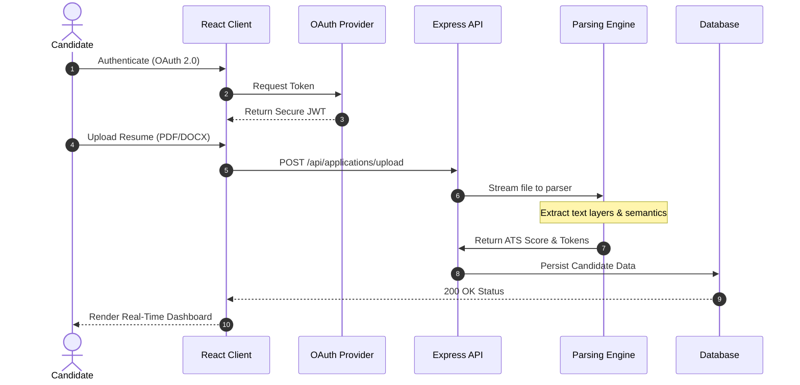
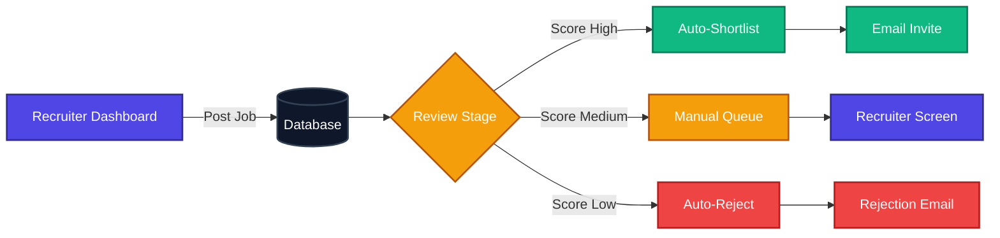
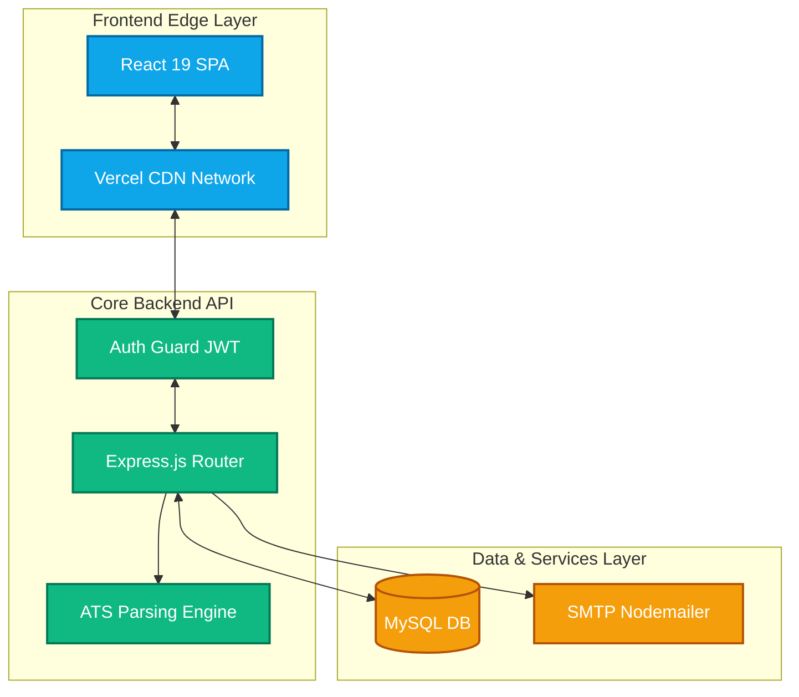

<!-- Dynamic Header -->
<div align="center">
  
</div>

<div align="center">
  <a href="https://talent-bridge-secure-enterprise-ful.vercel.app/" target="_blank">
    
  </a>
  
  
</div>

<div align="center">
  <a href="https://talent-bridge-secure-enterprise-ful.vercel.app/">
    
  </a>
</div>

---

## 🌟 Vision & Business ROI

**TalentBridge** is a modern, high-performance recruitment ecosystem engineered to solve the most expensive problem in HR: **Time-to-Hire (TTH)**. 

By integrating a proprietary **Applicant Tracking System (ATS)** engine directly into the application pipeline, TalentBridge automatically parses complex PDFs, tokenizes candidate data, and scores them against job descriptions. This eliminates manual screening, resulting in a **60% reduction in recruiter workload** while offering candidates a frictionless, real-time application experience.

---

## 🔄 Core Workflows & System Architecture

To truly understand the power of TalentBridge, here is a visual breakdown of the ecosystem's workflows.

### 1. The Candidate Journey (End-to-End)
This sequence illustrates the frictionless, highly secure pipeline a candidate experiences, from OAuth login to AI-powered resume parsing.



### 2. The Recruiter Ecosystem Flow
How enterprise recruiters manage the influx of applications using automated sorting and 1-click email workflows.



### 3. Global System Architecture
The high-level macro view of how the decoupled Client, Edge Load Balancers, and Core API interact.



---

## 💻 Tech Stack Showcase

<table align="center" width="100%">
  <tr>
    <td align="center" width="33%">
      <h3>Frontend</h3>
      <br>
      <b>React 19, Tailwind CSS, Axios</b><br>
      <i>Optimistic UI, Memoization, Fluid Layouts</i>
    </td>
    <td align="center" width="33%">
      <h3>Backend</h3>
      <br>
      <b>Node.js, Express 5, MySQL2</b><br>
      <i>REST API, JWT, Multer, MVC Pattern</i>
    </td>
    <td align="center" width="33%">
      <h3>Integrations</h3>
      <br>
      <b>Passport.js, Nodemailer, ATS</b><br>
      <i>OAuth 2.0, SMTP, Tokenization</i>
    </td>
  </tr>
</table>

---

## 🎯 Role-Based Data Isolation

TalentBridge enforces strict authorization middleware, guaranteeing deep data privacy.

| 👨‍💼 **Candidate Pipeline** | 🏢 **Recruiter Suite** | 🛡️ **Super Admin Control** |
| :--- | :--- | :--- |
| OAuth (Google/GitHub) 1-Click Auth | Enterprise Email / 2FA Ready | Secure Master Global Login |
| Advanced Semantic Job Filtering | Create, Edit & Archive Job Postings | Global Job & User Moderation |
| Encrypted Multi-format Uploads | View AI-Parsed Candidate Insights | System-wide Audit Logs |
| Real-time WebSocket Status Tracking | Kanban-style Pipeline View | Advanced RBAC Configurations |

---

## 🛡️ Enterprise Security & Compliance

> **Handling PII (Personally Identifiable Information) requires zero-trust security architecture.**

| Threat Vector | Mitigation Strategy | Technology Utilized |
| :--- | :--- | :--- |
| 💉 **SQL Injection** | Parameterized query layers intercept and sanitize all incoming data streams. | `mysql2` Prepared Statements |
| 🕵️‍♂️ **Session Hijacking** | Stateless tokens are issued with strict expiration and HTTP-only cookie flags, neutralizing CSRF & XSS. | `jsonwebtoken` & `cors` |
| 🦠 **Malicious Payloads** | Incoming streams are intercepted; enforcing rigid MIME-type boundaries (PDF/DOCX) & MB limits. | `multer` Middleware |

---

## 🚀 Quick Start / Local Deployment

> Get the entire enterprise platform running locally in under **3 minutes**.

<details open>
<summary><b>🛠️ Step 1: Database Setup</b></summary>
<br>
Ensure MySQL is active on port <code>3306</code>, then execute:

```sql
CREATE DATABASE talentbridge_db;
```
</details>

<details open>
<summary><b>⚙️ Step 2: Backend Initialization</b></summary>
<br>

```bash
cd backend
npm install
cp .env.example .env # Inject your local DB & OAuth secrets
npm run dev
```
</details>

<details open>
<summary><b>🌐 Step 3: Frontend Initialization</b></summary>
<br>

```bash
cd frontend
npm install
npm start
```
<i>The application will securely mount at <a href="http://localhost:3000">http://localhost:3000</a>.</i>
</details>

---

<br>

<div align="center">
  
  <h2>✨ Architected & Developed with ❤️ by Ruthwik</h2>
  <p><i>"Pushing the boundaries of recruitment technology, one line of code at a time."</i></p>
  
  <br>

  <a href="https://talent-bridge-secure-enterprise-ful.vercel.app/">
    
  </a>
  &nbsp;&nbsp;&nbsp;
  <a href="https://github.com/ruthwik-thotapelli/TalentBridge-Secure-Enterprise-Full-Stack-Hiring-Platform/issues">
    
  </a>
  <br><br>
</div>
