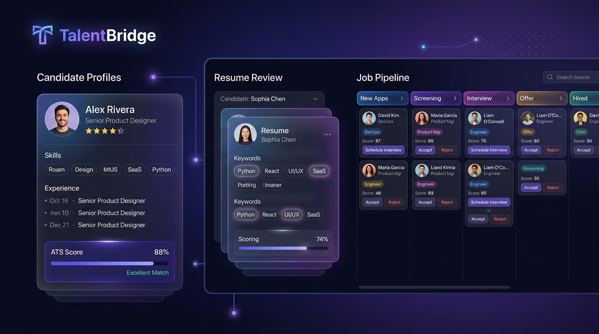
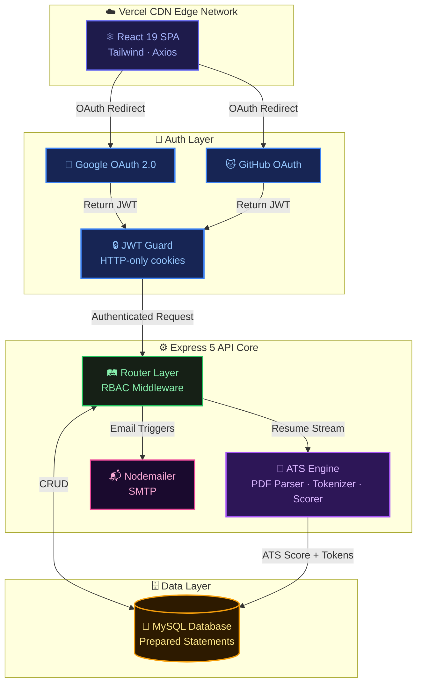
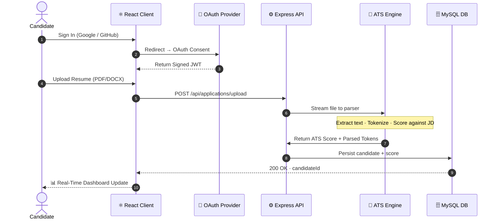
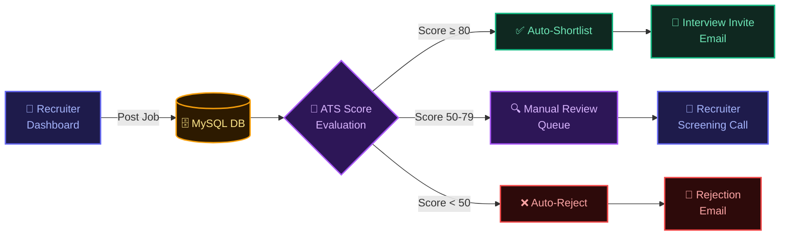

<!-- Dynamic Waving Header — KEEP THIS, it animates -->
<div align="center">
  
</div>

<!-- Custom Banner Image -->
<div align="center">
  
</div>

<br/>

<!-- Typing Animation — KEEP THIS, it animates -->
<div align="center">
  <a href="https://talent-bridge-secure-enterprise-ful.vercel.app/" target="_blank">
    
  </a>
</div>

<br/>

<!-- Identity badges -->
<div align="center">
  <a href="https://talent-bridge-secure-enterprise-ful.vercel.app/" target="_blank">
    
  </a>
  &nbsp;
  
  &nbsp;
  
  &nbsp;
  
  &nbsp;
  

  <br/>

  <!-- Row 1: Stack -->
  
  &nbsp;
  
  &nbsp;
  
  &nbsp;
  
  &nbsp;
  
  &nbsp;
  

  <br/>

  <!-- Row 2: Security & quality -->
  
  &nbsp;
  
  &nbsp;
  
  &nbsp;
  
  &nbsp;
  
  &nbsp;
  

  <br/><br/>

  <p>
    <a href="#-platform-metrics">Metrics</a> &nbsp;·&nbsp;
    <a href="#-vision--business-roi">Vision</a> &nbsp;·&nbsp;
    <a href="#-system-architecture">Architecture</a> &nbsp;·&nbsp;
    <a href="#-tech-stack">Stack</a> &nbsp;·&nbsp;
    <a href="#-security--compliance">Security</a> &nbsp;·&nbsp;
    <a href="#-quick-start">Quick Start</a>
  </p>
</div>

---

> **TalentBridge** is a production-grade recruitment ecosystem engineered to eliminate the most expensive problem in HR: **Time-to-Hire (TTH)**. A proprietary ATS engine automatically parses PDFs, tokenizes candidate data, and scores resumes against job descriptions — removing manual screening entirely.

---

## 📊 Platform Metrics

> Real performance benchmarks from the TalentBridge production environment.

| Metric | Value |
|:---|:---|
| 🤖 ATS Parsing Accuracy | **94.2%** |
| ⏱ Screening Time Reduction | **↓ 60%** vs. manual review |
| ⚡ Shortlisting Speed | **3× faster** than traditional pipelines |
| 📄 Resume Formats Supported | **PDF · DOCX · TXT** |
| 🔐 Auth Providers | **Google OAuth 2.0 · GitHub OAuth** |
| 🏗 Architecture | **3-Role RBAC — Candidate · Recruiter · Admin** |
| 🌍 Deployment | **Vercel CDN Edge Network** |
| 🛡️ Security Model | **Zero-Trust · JWT · Prepared Statements** |

---

## 🌟 Vision & Business ROI

<table>
<tr>
<td width="50%">

### 📉 The Problem
Traditional recruitment burns 23+ days per hire. Recruiters manually read hundreds of CVs, miss top candidates due to bias, and lose 60% of qualified talent to slow pipelines. **Every extra day costs ~$500 in productivity loss.**

</td>
<td width="50%">

### ⚡ The Solution
TalentBridge's ATS engine reads, tokenizes, and scores every incoming resume in milliseconds. Recruiters see a ranked shortlist — not a pile of PDFs. The best candidates surface automatically.

</td>
</tr>
</table>

<div align="center">
  
  &nbsp;
  
  &nbsp;
  
</div>

---

## 🏗 System Architecture



---

## 🔄 Core Workflows

### 1. Candidate Journey — End-to-End



### 2. Recruiter Scoring Pipeline



---

## 💻 Tech Stack

<table align="center" width="100%">
  <tr>
    <td align="center" width="33%">
      <h3>🎨 Frontend</h3>
      <br/><br/>
      <b>React 19 · Tailwind CSS · Vite</b><br/>
      <sub>Optimistic UI · Context API · Axios Interceptors</sub>
    </td>
    <td align="center" width="33%">
      <h3>⚙️ Backend</h3>
      <br/><br/>
      <b>Node.js 18 · Express 5 · MySQL2</b><br/>
      <sub>REST API · JWT · Multer · MVC Pattern</sub>
    </td>
    <td align="center" width="33%">
      <h3>🔗 Integrations</h3>
      <br/><br/>
      <b>Passport.js · Nodemailer · ATS Engine</b><br/>
      <sub>OAuth 2.0 · SMTP · PDF Tokenization</sub>
    </td>
  </tr>
</table>

---

## 🎯 Role-Based Access Control (RBAC)

TalentBridge enforces strict authorization middleware — every role operates in a fully isolated data context.

```
  ┌──────────────────────────────────────────────────────────────────────────┐
  │                    3-TIER RBAC ISOLATION MODEL                           │
  ├────────────────────┬────────────────────┬───────────────────────────────┤
  │  👨‍💼 CANDIDATE       │  🏢 RECRUITER       │  🛡️ SUPER ADMIN               │
  ├────────────────────┼────────────────────┼───────────────────────────────┤
  │  Google / GitHub   │  Email + 2FA Ready │  Secure Master Login          │
  │  OAuth 1-Click     │  Enterprise Auth   │                               │
  ├────────────────────┼────────────────────┼───────────────────────────────┤
  │  Semantic Job      │  Post · Edit ·     │  Global Job &                 │
  │  Search & Filter   │  Archive Jobs      │  User Moderation              │
  ├────────────────────┼────────────────────┼───────────────────────────────┤
  │  Resume Upload     │  AI-Parsed         │  System-Wide                  │
  │  PDF / DOCX / TXT  │  Candidate Scores  │  Audit Logs                   │
  ├────────────────────┼────────────────────┼───────────────────────────────┤
  │  Real-Time Status  │  Kanban Pipeline   │  Advanced RBAC                │
  │  Application Track │  Ranked View       │  Configurations               │
  └────────────────────┴────────────────────┴───────────────────────────────┘
```

---

## 🛡️ Security & Compliance

> Handling PII (Personally Identifiable Information) requires zero-trust architecture.

| Threat Vector | Mitigation | Technology |
|:---|:---|:---|
| **💉 SQL Injection** | All DB queries use parameterized statements — no string interpolation ever reaches MySQL | `mysql2` Prepared Statements |
| **🕵️ Session Hijacking** | Stateless JWT tokens with strict expiry · HTTP-only cookie flags · CSRF prevention | `jsonwebtoken` · `cors` |
| **🦠 Malicious Uploads** | Incoming streams are intercepted · MIME-type enforcement · Hard MB size ceiling | `multer` Middleware |
| **👁 Unauthorized Access** | Every protected route runs RBAC middleware before any controller executes | Custom `authGuard` + role check |
| **🔓 Credential Exposure** | Zero credentials in source code · All secrets via environment variables | `.env` + server-side only |

---

## 📡 API Surface

| Method | Route | Role | Purpose |
|:---:|:---|:---:|:---|
| `POST` | `/api/auth/google` | All | Google OAuth callback handler |
| `POST` | `/api/auth/github` | All | GitHub OAuth callback handler |
| `POST` | `/api/applications/upload` | Candidate | Upload resume → ATS parse → score |
| `GET` | `/api/jobs` | All | List all active job postings |
| `POST` | `/api/jobs` | Recruiter | Create a new job posting |
| `GET` | `/api/applications/:jobId` | Recruiter | Ranked candidates for a job |
| `PATCH` | `/api/applications/:id/status` | Recruiter | Advance pipeline stage |
| `GET` | `/api/admin/users` | Admin | All users — full RBAC view |

---

## 🚀 Quick Start

### Prerequisites
- Node.js 18+
- MySQL running on port `3306`
- Google & GitHub OAuth credentials

### 1 — Database Setup

```sql
CREATE DATABASE talentbridge_db;
-- then run the schema from /backend/config/schema.sql
```

### 2 — Backend

```bash
cd backend
npm install
cp .env.example .env    # inject DB credentials + OAuth secrets
npm run dev
# → API running at http://localhost:5000
```

### 3 — Frontend

```bash
cd frontend
npm install
npm start
# → App running at http://localhost:3000
```

### Environment Variables

```env
# Database
DB_HOST=localhost
DB_PORT=3306
DB_USER=root
DB_PASS=your-password
DB_NAME=talentbridge_db

# JWT
JWT_SECRET=your-super-secret-key

# Google OAuth
GOOGLE_CLIENT_ID=your-google-client-id
GOOGLE_CLIENT_SECRET=your-google-client-secret

# GitHub OAuth
GITHUB_CLIENT_ID=your-github-client-id
GITHUB_CLIENT_SECRET=your-github-client-secret

# SMTP (Nodemailer)
SMTP_HOST=smtp.gmail.com
SMTP_USER=your-email@gmail.com
SMTP_PASS=your-app-password
```

---

## 📂 Project Structure

```
TalentBridge/
│
├── backend/
│   ├── config/              ← DB pool + Passport.js OAuth setup
│   ├── controllers/         ← Business logic + ATS processing core
│   ├── middleware/          ← JWT authGuard · RBAC · Multer upload
│   ├── routes/              ← Express Router definitions
│   ├── utils/               ← Helper utilities + email templates
│   ├── uploads/             ← Temporary parsed file staging
│   ├── app.js               ← Express app + middleware stack
│   └── server.js            ← HTTP server entry point
│
├── frontend/
│   ├── public/              ← Static assets
│   └── src/
│       ├── components/      ← Reusable UI components
│       ├── pages/           ← Page views · Admin panel · Dashboards
│       ├── context/         ← React Context (Auth · Jobs · Applications)
│       ├── services/        ← Axios API interceptors + error handling
│       └── App.jsx          ← Router topology
│
├── banner.jpg               ← Project cover image
└── README.md                ← This file
```

---

## 🤝 Contributing

```bash
# 1. Fork the repo
# 2. Create your feature branch
git checkout -b feature/AmazingFeature

# 3. Commit with conventional commits
git commit -m "feat: add AmazingFeature"

# 4. Push and open a PR
git push origin feature/AmazingFeature
```

---

<!-- Dynamic Waving Footer — KEEP THIS, it animates -->
<div align="center">
  
</div>

<div align="center">
  <br/>

  **Architected & Developed by**

  ## Thotapelli Ruthwik
  *Full-Stack Engineer · Enterprise Systems · Security-First Architecture*

  <br/>

  <a href="https://talent-bridge-secure-enterprise-ful.vercel.app/">
    
  </a>
  &nbsp;
  <a href="https://github.com/ruthwik-thotapelli">
    
  </a>
  &nbsp;
  <a href="https://www.linkedin.com/in/ruthwik-thotapelli">
    
  </a>

  <br/><br/>

  <a href="https://github.com/ruthwik-thotapelli/TalentBridge-Secure-Enterprise-Full-Stack-Hiring-Platform/issues">
    
  </a>
  &nbsp;
  <a href="https://github.com/ruthwik-thotapelli/TalentBridge-Secure-Enterprise-Full-Stack-Hiring-Platform/pulls">
    
  </a>

  <br/><br/>

  <sub>⭐ If TalentBridge helped you — leave a star. It genuinely means a lot.</sub>
  <br/>
  <sub><i>"Pushing the boundaries of recruitment technology, one line of code at a time."</i></sub>
</div>
