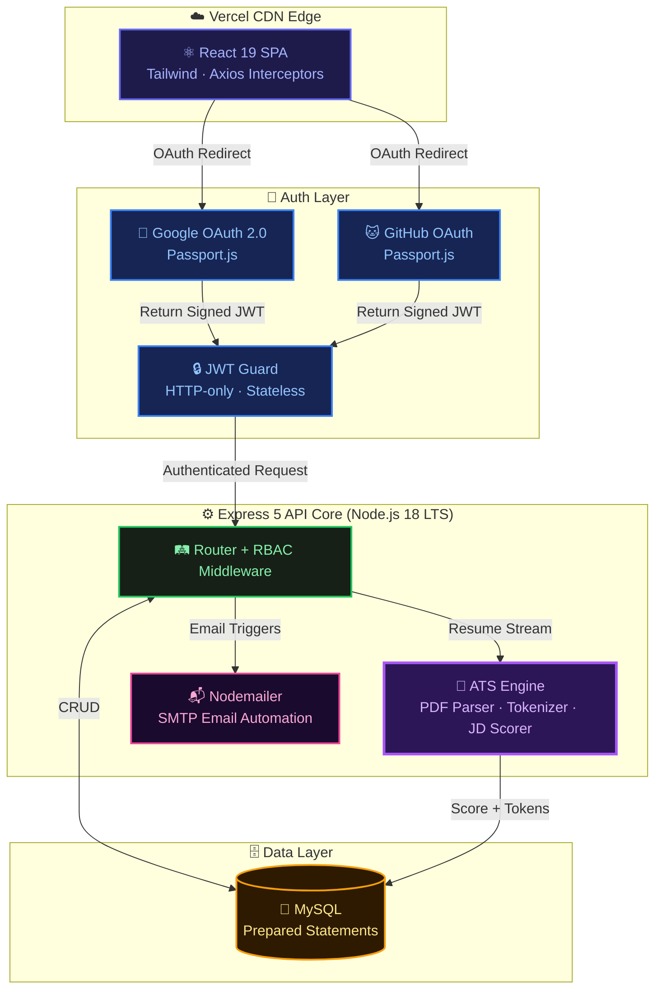
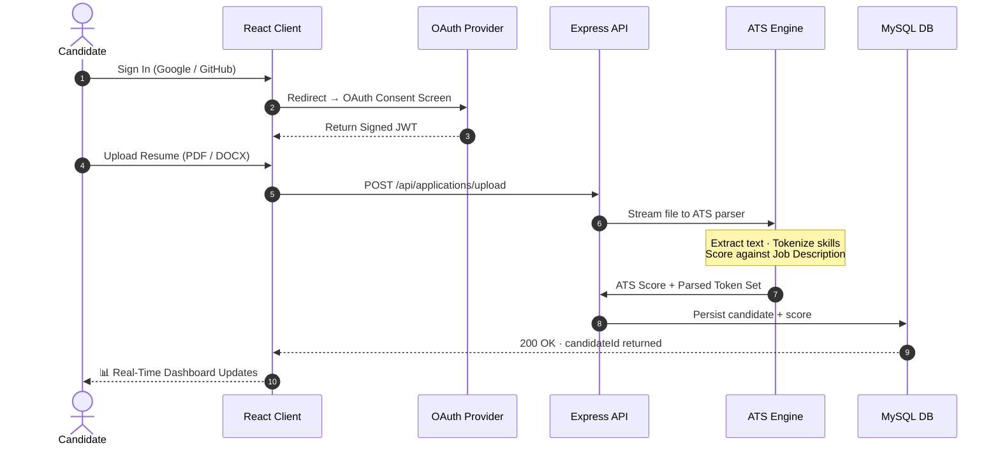
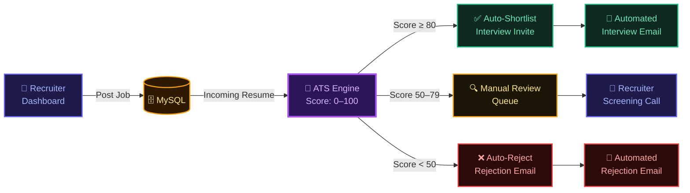

<!-- Animated Header — indigo/purple to match banner -->
<div align="center">
  
</div>

<!-- Full HD Dashboard Screenshot -->
<div align="center">
  
</div>

<br/>

<!-- Typing animation -->
<div align="center">
  <a href="https://talent-bridge-secure-enterprise-ful.vercel.app/" target="_blank">
    
  </a>
</div>

<br/>

<div align="center">

  <!-- CTA -->
  <a href="https://talent-bridge-secure-enterprise-ful.vercel.app/" target="_blank">
    
  </a>

  <br/><br/>

  <!-- Identity -->
  
  
  
  

  <br/>

  <!-- Tech stack -->
  
  &nbsp;
  
  &nbsp;
  
  &nbsp;
  
  &nbsp;
  
  &nbsp;
  
  &nbsp;
  
  &nbsp;
  
  &nbsp;
  

  <br/><br/>

  [Live Demo](https://talent-bridge-secure-enterprise-ful.vercel.app/) &nbsp;·&nbsp;
  [Architecture](#-system-architecture) &nbsp;·&nbsp;
  [Tech Stack](#-tech-stack) &nbsp;·&nbsp;
  [Security](#️-security--compliance) &nbsp;·&nbsp;
  [Quick Start](#-quick-start)

</div>

---

> **TalentBridge** eliminates the most expensive problem in HR: **Time-to-Hire**. A proprietary ATS engine reads every incoming PDF, tokenizes candidate data, and scores it against job descriptions in milliseconds — before a recruiter reads a single line. The result: ranked shortlists instead of stacks of paper.

---

## 📊 Platform Metrics

| Metric | Value |
|:---|:---|
| 🤖 ATS Resume Parsing Accuracy | **94.2%** |
| ⏱ Reduction in Manual Screening Time | **↓ 60%** |
| ⚡ Candidate Shortlisting Speed | **3× faster** than traditional pipelines |
| 📄 Supported Resume Formats | **PDF · DOCX · TXT** |
| 🔐 Authentication Providers | **Google OAuth 2.0 · GitHub OAuth** |
| 🏗 Authorization Model | **3-Role RBAC — Candidate · Recruiter · Admin** |
| 🌍 Deployment | **Vercel CDN Global Edge Network** |
| 🛡️ Security Model | **Zero-Trust · Stateless JWT · Prepared Statements** |

---

## 💡 Why TalentBridge Exists

<table>
<tr>
<td width="50%">

### 😩 The Problem
The average enterprise takes **23 days to hire**. Recruiters manually read hundreds of CVs, miss top candidates due to cognitive bias, and lose qualified talent to slow pipelines.

**Every extra day costs ~$500 in productivity loss.**

</td>
<td width="50%">

### ⚡ The Solution
TalentBridge scores every resume **automatically**. Recruiters open their dashboard to a ranked, scored shortlist — not a pile of unread PDFs. The best candidates surface in seconds.

**The ATS engine never sleeps. It never gets tired. It never gets biased.**

</td>
</tr>
</table>

---

## 🏗 System Architecture



---

## 🔄 Candidate Journey — End to End



---

## 🎯 Recruiter Scoring Pipeline



---

## 💻 Tech Stack

<table align="center">
  <tr>
    <td align="center" width="33%">
      <h3>🎨 Frontend</h3>
      <br/><br/>
      <b>React 19 · Tailwind CSS · Vite</b><br/>
      <sub>Context API · Axios Interceptors · Optimistic UI</sub>
    </td>
    <td align="center" width="33%">
      <h3>⚙️ Backend</h3>
      <br/><br/>
      <b>Node.js 18 · Express 5 · MySQL2</b><br/>
      <sub>MVC Pattern · Multer · REST API · JWT</sub>
    </td>
    <td align="center" width="33%">
      <h3>🔗 Integrations</h3>
      <br/><br/>
      <b>Passport.js · Nodemailer · ATS</b><br/>
      <sub>OAuth 2.0 · SMTP · PDF Tokenization</sub>
    </td>
  </tr>
</table>

---

## 🛡️ 3-Tier RBAC — Data Isolation

```
  ┌──────────────────────────────────────────────────────────────────────────────┐
  │                      ROLE-BASED ACCESS CONTROL MODEL                         │
  ├──────────────────────┬─────────────────────────┬──────────────────────────── ┤
  │  👤 CANDIDATE         │  🏢 RECRUITER            │  🛡️ SUPER ADMIN              │
  ├──────────────────────┼─────────────────────────┼─────────────────────────────┤
  │  Google / GitHub     │  Email + 2FA Ready       │  Secure Master Login         │
  │  OAuth 1-Click Auth  │  Enterprise Auth         │  Global Access               │
  ├──────────────────────┼─────────────────────────┼─────────────────────────────┤
  │  Semantic Job Search │  Post · Edit · Archive   │  Job + User Moderation       │
  │  & Filter            │  Job Postings            │  System-Wide                 │
  ├──────────────────────┼─────────────────────────┼─────────────────────────────┤
  │  Resume Upload       │  AI-Scored Candidate     │  System-Wide                 │
  │  PDF / DOCX / TXT    │  Ranked Insights         │  Audit Logs                  │
  ├──────────────────────┼─────────────────────────┼─────────────────────────────┤
  │  Real-Time Status    │  Kanban Pipeline View    │  Advanced RBAC               │
  │  Tracking            │  Accept · Reject         │  Configurations              │
  └──────────────────────┴─────────────────────────┴─────────────────────────────┘
```

---

## 🔒 Security & Compliance

> Handling PII (Personally Identifiable Information) requires zero-trust architecture at every layer.

| Threat | Mitigation | Implementation |
|:---|:---|:---|
| 💉 **SQL Injection** | Parameterized queries — no string interpolation touches the DB | `mysql2` Prepared Statements |
| 🕵️ **Session Hijacking** | Stateless JWT with expiry + HTTP-only cookie flags blocking CSRF/XSS | `jsonwebtoken` · `cors` |
| 🦠 **Malicious Uploads** | Hard MIME-type enforcement + MB ceiling on all streams | `multer` Middleware |
| 👁 **Unauthorized Access** | Every protected route runs RBAC middleware before controller | Custom `authGuard` |
| 🔓 **Credential Exposure** | Zero secrets in source — all credentials via server-side env vars | `.env` only |

---

## 📡 API Reference

| Method | Endpoint | Role | Description |
|:---:|:---|:---:|:---|
| `POST` | `/api/auth/google` | All | Google OAuth callback |
| `POST` | `/api/auth/github` | All | GitHub OAuth callback |
| `POST` | `/api/applications/upload` | Candidate | Upload resume → ATS parse → persist score |
| `GET` | `/api/jobs` | All | List all active job postings |
| `POST` | `/api/jobs` | Recruiter | Create a new job posting |
| `GET` | `/api/applications/:jobId` | Recruiter | Ranked + scored candidates for a job |
| `PATCH` | `/api/applications/:id/status` | Recruiter | Advance candidate pipeline stage |
| `GET` | `/api/admin/users` | Admin | System-wide user view + RBAC controls |

---

## 🚀 Quick Start

### Prerequisites
- Node.js 18+ · MySQL on port `3306` · Google & GitHub OAuth credentials

### 1 — Database

```sql
CREATE DATABASE talentbridge_db;
```

### 2 — Backend

```bash
cd backend
npm install
cp .env.example .env    # inject credentials
npm run dev             # → http://localhost:5000
```

### 3 — Frontend

```bash
cd frontend
npm install
npm start               # → http://localhost:3000
```

### `.env` Reference

```env
DB_HOST=localhost         DB_PORT=3306
DB_USER=root              DB_PASS=your-password
DB_NAME=talentbridge_db   JWT_SECRET=your-secret

GOOGLE_CLIENT_ID=...      GOOGLE_CLIENT_SECRET=...
GITHUB_CLIENT_ID=...      GITHUB_CLIENT_SECRET=...

SMTP_HOST=smtp.gmail.com  SMTP_USER=you@gmail.com
SMTP_PASS=your-app-password
```

---

## 📂 Project Structure

```
TalentBridge/
├── backend/
│   ├── config/          ← DB pool · Passport OAuth setup
│   ├── controllers/     ← Business logic · ATS core processing
│   ├── middleware/      ← JWT authGuard · RBAC · Multer
│   ├── routes/          ← Express Router definitions
│   ├── utils/           ← Helpers · Email templates
│   └── server.js        ← HTTP entry point
│
├── frontend/
│   └── src/
│       ├── components/  ← Reusable UI components
│       ├── pages/       ← Dashboard · Admin · Job views
│       ├── context/     ← Auth · Jobs · Applications state
│       └── App.jsx      ← Router topology
│
├── banner.jpg           ← Full-HD platform screenshot
└── README.md            ← This file
```

---

<!-- Animated Footer -->
<div align="center">
  
</div>

<div align="center">
  <br/>

  **Architected & Developed by**

  ## Thotapelli Ruthwik
  *Full-Stack Engineer · Enterprise Systems · Security-First Architecture*

  <br/>

  <a href="https://talent-bridge-secure-enterprise-ful.vercel.app/">
    
  </a>
  &nbsp;
  <a href="https://github.com/ruthwik-thotapelli">
    
  </a>
  &nbsp;
  <a href="https://www.linkedin.com/in/ruthwik-thotapelli">
    
  </a>

  <br/><br/>

  <a href="https://github.com/ruthwik-thotapelli/TalentBridge-Secure-Enterprise-Full-Stack-Hiring-Platform/issues">
    
  </a>
  &nbsp;
  <a href="https://github.com/ruthwik-thotapelli/TalentBridge-Secure-Enterprise-Full-Stack-Hiring-Platform/pulls">
    
  </a>

  <br/><br/>
  <sub>⭐ If TalentBridge impressed you — leave a star. It genuinely means a lot.</sub>
  <br/>
  <sub><i>"Pushing the boundaries of recruitment technology, one commit at a time."</i></sub>
</div>
