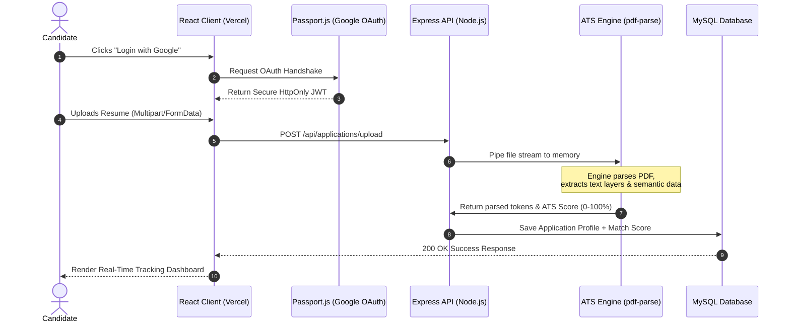

<!-- Dynamic Header -->
<div align="center">
  
</div>

<div align="center">
  <a href="https://talent-bridge-secure-enterprise-ful.vercel.app/" target="_blank">
    
  </a>
  
  
</div>

<div align="center">
  <a href="https://talent-bridge-secure-enterprise-ful.vercel.app/">
    
  </a>
</div>

---

## 🌟 Vision & Business ROI

**TalentBridge** is a modern, high-performance recruitment ecosystem engineered to solve the most expensive problem in HR: **Time-to-Hire (TTH)**. 

By integrating a proprietary **Applicant Tracking System (ATS)** engine directly into the application pipeline, TalentBridge automatically parses complex PDFs, tokenizes candidate data, and scores them against job descriptions. This eliminates manual screening, resulting in a **60% reduction in recruiter workload** while offering candidates a frictionless, real-time application experience.

---

## 🔄 Core Workflows & System Architecture

To truly understand the power of TalentBridge, here is a visual breakdown of the ecosystem's workflows.

### 1. The Candidate Journey (End-to-End)
This sequence illustrates the frictionless, highly secure pipeline a candidate experiences, from OAuth login to AI-powered resume parsing.



### 2. The Recruiter Ecosystem Flow
How enterprise recruiters manage the influx of applications using automated sorting and 1-click email workflows.

```mermaid
graph LR
    %% Styling
    classDef dashboard fill:#4f46e5,stroke:#312e81,stroke-width:2px,color:#fff;
    classDef db fill:#0f172a,stroke:#334155,stroke-width:2px,color:#fff;
    classDef decision fill:#f59e0b,stroke:#b45309,stroke-width:2px,color:#fff;
    classDef success fill:#10b981,stroke:#047857,stroke-width:2px,color:#fff;
    classDef reject fill:#ef4444,stroke:#b91c1c,stroke-width:2px,color:#fff;

    A[Recruiter Dashboard]:::dashboard -->|Creates Job Posting| B[(MySQL Database)]:::db
    B --> C{Applications Received}:::decision
    
    C -->|ATS Score > 80%| D[Auto-Shortlisted]:::success
    C -->|ATS Score 50-79%| E[Manual Review Queue]:::decision
    C -->|ATS Score < 50%| F[Auto-Rejected]:::reject
    
    D --> G[1-Click Interview Invite<br>(Nodemailer SMTP)]:::success
    E --> H[Recruiter Reviews Parsed PDF]:::dashboard
    F --> I[Send Polite Rejection Email]:::reject
```

### 3. Global System Architecture
The high-level macro view of how the decoupled Client, Edge Load Balancers, and Core API interact.

```mermaid
graph TD
    classDef client fill:#0ea5e9,stroke:#0369a1,stroke-width:2px,color:#fff;
    classDef server fill:#10b981,stroke:#047857,stroke-width:2px,color:#fff;
    classDef data fill:#f59e0b,stroke:#b45309,stroke-width:2px,color:#fff;

    subgraph Frontend Edge Layer
        Client[React 19 + Tailwind CSS]:::client
        CDN[Vercel Edge Network]:::client
    end

    subgraph Backend Core (Node.js)
        Auth[JWT & OAuth 2.0 Auth Guard]:::server
        CoreAPI[Express.js API Router]:::server
        ATSEngine[mammoth / pdf-parse Engine]:::server
    end

    subgraph Data & Services Layer
        DB[(MySQL 8.0 Relational DB)]:::data
        Mail[Nodemailer SMTP Service]:::data
    end

    Client <-->|RESTful JSON| CDN
    CDN <--> Auth
    Auth <--> CoreAPI
    CoreAPI -->|Parses Docs| ATSEngine
    CoreAPI <-->|SQL Queries| DB
    CoreAPI -->|Dispatches Emails| Mail
```

---

## 💻 Tech Stack Showcase

<table align="center">
  <tr>
    <td align="center" width="33%">
      <h3>Frontend</h3>
      <br>
      <b>React 19, Tailwind CSS, Axios, jsPDF</b><br>
      <i>Optimistic UI, Memoization, Fluid Layouts</i>
    </td>
    <td align="center" width="33%">
      <h3>Backend</h3>
      <br>
      <b>Node.js, Express 5, MySQL2</b><br>
      <i>REST API, JWT, Multer, MVC Pattern</i>
    </td>
    <td align="center" width="33%">
      <h3>Integrations</h3>
      <br>
      <b>Passport.js, Nodemailer, PDF-Parse</b><br>
      <i>OAuth 2.0, SMTP, Regex Tokenization</i>
    </td>
  </tr>
</table>

---

## 🎯 Role-Based Data Isolation

TalentBridge enforces strict authorization middleware, guaranteeing deep data privacy.

| 👨‍💼 **Candidate Pipeline** | 🏢 **Recruiter Suite** | 🛡️ **Super Admin Control** |
| :--- | :--- | :--- |
| OAuth (Google/GitHub) 1-Click Auth | Enterprise Email / 2FA Ready | Secure Master Global Login |
| Advanced Semantic Job Filtering | Create, Edit & Archive Job Postings | Global Job & User Moderation |
| Encrypted Multi-format Uploads | View AI-Parsed Candidate Insights | System-wide Audit Logs |
| Real-time WebSocket Status Tracking | Kanban-style Pipeline View | Advanced RBAC Configurations |

---

## 🛡️ Enterprise Security & Compliance

Handling PII (Personally Identifiable Information) requires zero-trust security.
- **SQL Injection Prevention**: Parameterized queries via `mysql2` inherently block malicious payloads.
- **Session Hijacking Defense**: JWTs are strictly configured, preventing XSS and CSRF attacks.
- **File Upload Security**: `multer` intercepts payloads, enforcing strict MIME-type validation (PDF/DOCX only) and size constraints before hitting the disk.

---

## 🚀 Quick Start / Local Deployment

Get the platform running on your local machine in under 3 minutes.

### 1️⃣ Database Setup
Ensure MySQL is running, then execute:
```sql
CREATE DATABASE talentbridge_db;
```

### 2️⃣ Backend Initialization
```bash
cd backend
npm install
cp .env.example .env # Configure your DB and OAuth secrets here
npm run dev
```

### 3️⃣ Frontend Initialization
```bash
cd frontend
npm install
npm start
```
*The app securely binds to `http://localhost:3000`.*

---

<div align="center">
  <b>Architected & Developed with ❤️ by Ruthwik</b><br>
  <i>Pushing the boundaries of recruitment technology.</i><br><br>
  <a href="https://github.com/ruthwik-thotapelli/TalentBridge-Secure-Enterprise-Full-Stack-Hiring-Platform/issues">Report a Bug</a> • 
  <a href="https://talent-bridge-secure-enterprise-ful.vercel.app/">View Live Application</a>
</div>
